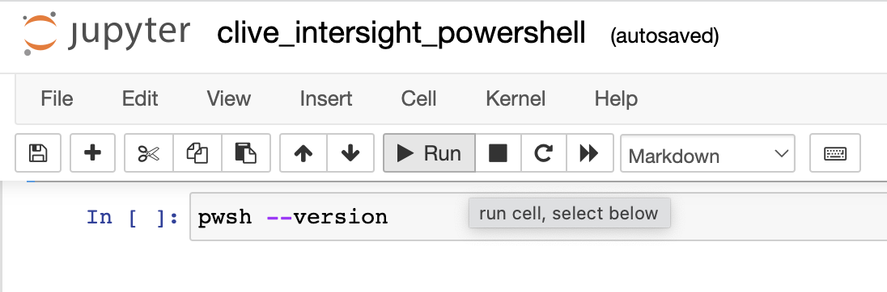

# DEVWKS-2254

Exploring Cisco Intersight PowerShell and Python SDK with Jupyter Notebook

This repository contains example code using Intersight's PowerShell Module and Python Package.  The example code and usage instructions are provided in Jupyter Notebooks that can be run interactively.  Docker can be used to build and run eveything needed by Jupyter Notebook.


## Build the Docker Image

> If you're in a DevNet lab the image should already be on your workstation so you can skip this step.

`make build` will build an image named developenv/devenv-base-bootstrap-dind-vpn with a Python and PowerShell environment almost ready to run Jupyter Notebook.

```
make build
```


## Run the Docker Image as a Container

`make run` will run the developenv/devenv-base-bootstrap-dind-vpn image as a container named developenv/devenv-base-bootstrap-dind-vpn.  Output from `make run` should provide a link to http://localhost:1001/?arg=secret that provides access to the container's shell.

```
make run
```


## Configure Jupyter Notebook

Once the container is running, go to http://localhost:1001/?arg=secret and run the following commands:

```
cd ~/src; . conf.sh
```

You should see output with a link similar to access the running notebook (be sure to use the link from the output - the access token will be unique each time the notebook is started).

```
...
   Or copy and paste one of these URLs:
        http://localhost:8888/?token=c9bdc16ec531f39c923cb7d4cf4c15a08edab2e8bbf55cf7
```

## Using Jupyter Notebook

After clicking on the link to access Jupyter, you should see a listing of available files.


Select clive_intersight_powershell.ipynb to run the PowerShell Notebook or select clive_intersight_python.ipynb for Python.

Once you launch a Notebook, you'll see detailed usage instructions along with example code to run.  You can move between cells in the notebook and edit or run code as needed.


